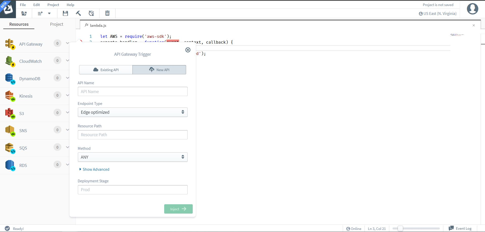
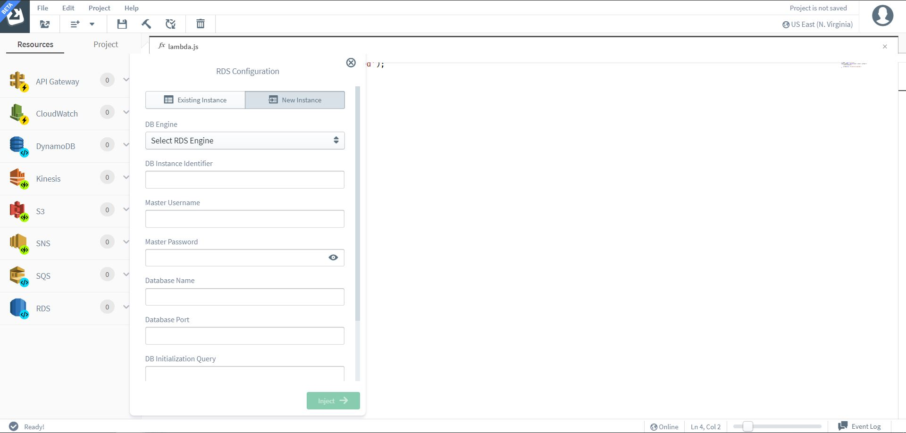
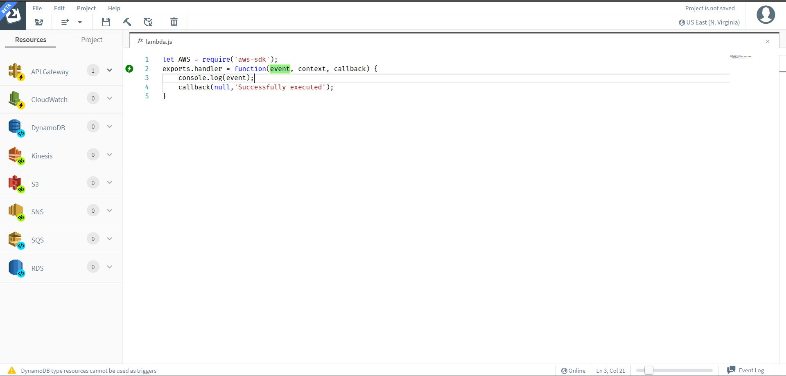

# Operations

In the Sigma IDE an operation is an atomic level of functionality offered by a **resource**/ **trigger**. An operation does not necessarily denote an AWS level of functionality. Sigma IDE intelligently offers operations for a **resource**/ **trigger** which otherwise a user might have to manually configure.

Operations are visible to a user once a component has been dragged on from the component pane on to the editor pane.

For example, the following diagram represents the operations available for an API Gateway resource.

# 

A new resource path can be inserted to a new API using the Trigger component. These operations correspond to AWS supported operations.

Consider another example, where we configure an RDS component. The following diagram represents the operations available for an RDS resource.

# 

In the RDS resource, You can configure the properties and operations available. In this case, the appropriate RDS operation has to be selected from the set of operations given (i.e. Query/ Begin Transaction).

After you've added a operation on to the pane, a green lightning symbol will indicate that the resource is editable.

Click on the symbol to edit and add the operations required. This feature is useful if you need to edit existing resource/ trigger operations.

# 

If there is an operation undetected, there might be an error with the code inserted. This specially affects resources such as RDS since the code generated is inserted on to the resource pane.
