# Getting Started with Sigma IDE on Google Cloud Platform

## Prerequisites

* a [**Google Cloud Platform subscription**](https://cloud.google.com/getting-started/);
if you already have a Google account, you can directly [sign up](https://console.cloud.google.com/freetrial).
* a [**GitHub**](https://github.com/) or [**BitBucket**](https://bitbucket.org/) account;
free to sign up if you don't have one already
* a fairly new web browser; Sigma has been tested on **Google Chrome 59+**, **Mozilla Firefox 58+**,
**Microsoft Edge 41+** and **Apple Safari 10.1.2+**

**NOTE:** Sigma will soon introduce support for [AWS CodeCommit](https://aws.amazon.com/codecommit/) repositories as well!

## Create a service account key.

**NOTE:** This step can be omitted if you already have a saved
[service account key file](https://developers.google.com/identity/protocols/OAuth2ServiceAccount#creatinganaccount)
for your GCP project.

1. Open the [Cloud Platform dashboard](https://console.cloud.google.com/home/dashboard).

2. If you do not have any GCP projects, create a new project. You can simply follow
[Google's official guide](https://cloud.google.com/resource-manager/docs/creating-managing-projects#creating_a_project).

3. Select your GCP project from the header drop-down.

   

4. Open the [GCP Service Accounts page](https://console.cloud.google.com/iam-admin/serviceaccounts).
You can use the **IAM & admin &rarr; Service accounts** menu item from within any of the dashboard pages.

   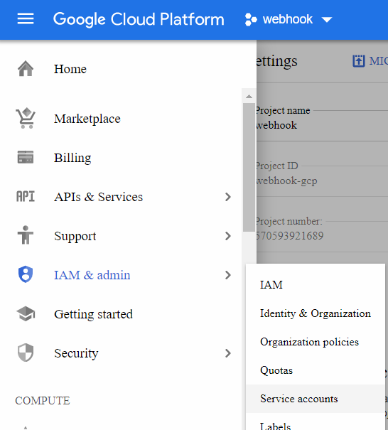

   Here you will see all service accounts of your project.
   Even if you have not created any service accounts manually, you will probably have the Google-provisioned
   [default service accounts](https://cloud.google.com/compute/docs/access/service-accounts#user-managed_service_accounts)
   for _App Engine_ or _Compute Engine_. These accounts are generally sufficient for Sigma's authorizations.

   Alternatively, you can choose or create a different service account that you would like to use to authorize Sigma.
   The account should possess permissions to:

   * Create and write to a new [Cloud Storage bucket](https://cloud.google.com/storage/docs/key-terms#buckets)
   * Run builds on [CloudBuild (Container Builder) service](https://cloud.google.com/cloud-build/)
   * Manage deployments on the [Deployment Manager service](https://cloud.google.com/deployment-manager/)
   * Access other GCP services that you intend to use in your Sigma project

   **NOTE:** If you are using GCP as a secondary platform (e.g. integrating GCP into an AWS-based project)
   you would only need the last permission.

   Refer the [Cloud Platform documentation](https://developers.google.com/identity/protocols/OAuth2ServiceAccount#creatinganaccount)
   if you want to create a new service account for Sigma.

5. Click the drop-down at the end of the service account entry, and choose **Create key**.

   

6. Ensure that **JSON** is selected as the **Key type**, and click **Create**.

   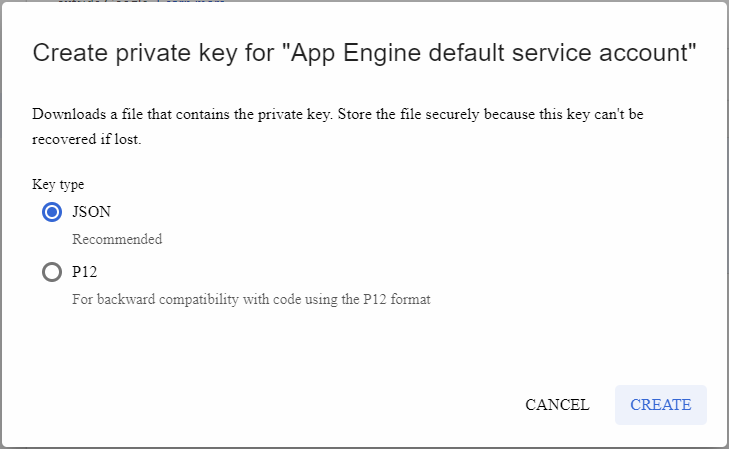

7. The private key file will be downloaded into your browser; keep it private and safe.

   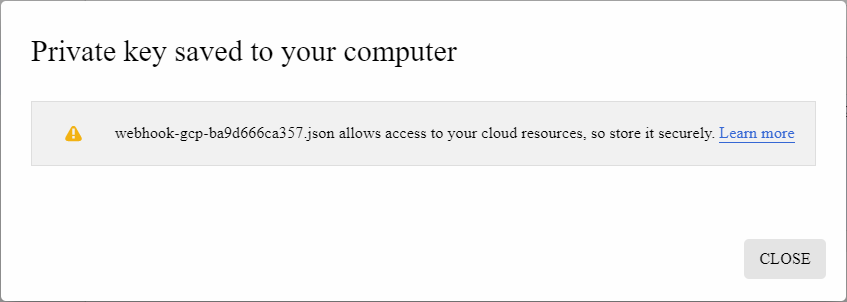

## Enable the required Google Cloud APIs for your GCP project.

If you hope to *deploy* your project on GCP (as opposed to *accessing* GCP APIs while running on a different platform like AWS),
you would need to enable the following APIs on your GCP project (which are not enabled by default):

* Cloud Functions API
* Cloud Build API
* Google Cloud Deployment Manager V2 API

1. Navigate to the [API Library page](https://console.cloud.google.com/apis/library).

   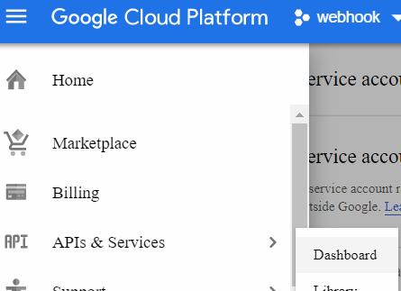

2. Click **Enable APIs and Services** on the page header.

   

3. Type the name of each API in the search bar.

   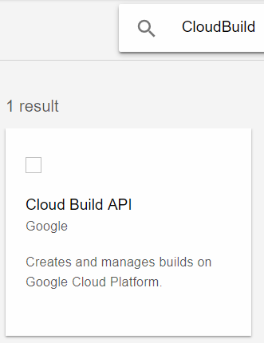

4. Click on the search result API tile, and click **Enable** on the API description page.

   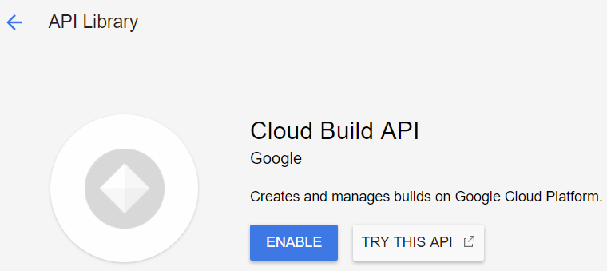

**NOTE:**

* It may take 2-3 minutes for an API to get enabled.
* If you wish to use any other APIs that are not listed in the
[default enabled APIs list](https://cloud.google.com/service-usage/docs/enabled-service),
you will need to explicitly enable them as well - *regardless of the deployment platform*.

## Sign up for Sigma.

Create new Sigma account (if you haven't already):

**NOTE**: You can avoid most of these steps if you sign in via a social media account (Facebook or Google).

1. Go to the [Sigma sign-in page](https://sigma.slappforge.com/#/signin).

   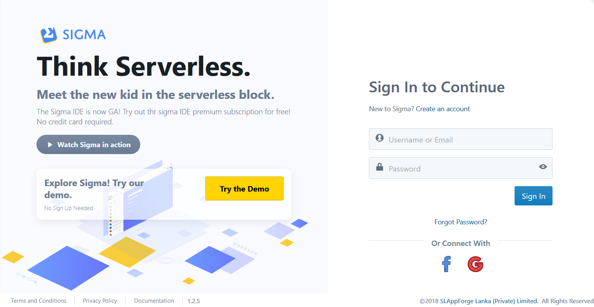

2. Click the **Create an account** link against the **New to Sigma?** message.

   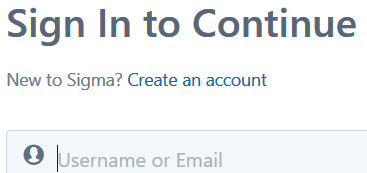

3. Fill in your first and last names, email, and phone number.

   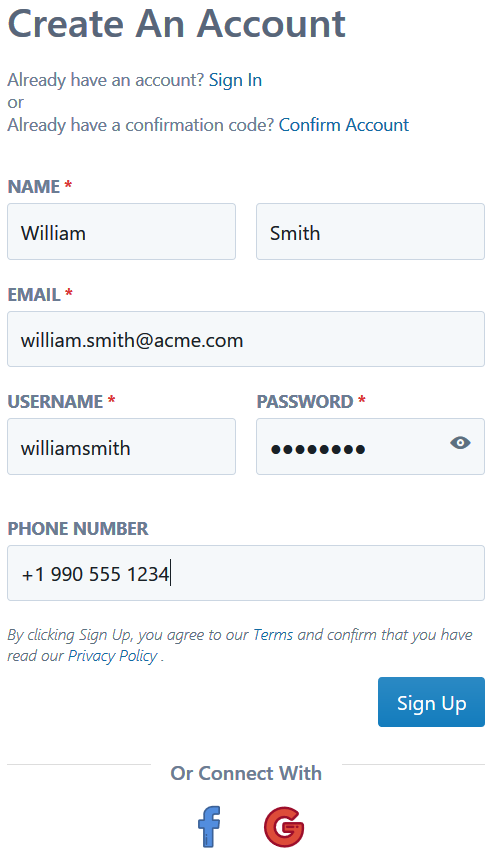

4. Take note of your *username*: Sigma will automatically generate one, using your first and last names.
You are free to change this to your own preference, as long as someone else has not used it already.

   

5. Choose a password. Passwords in Sigma need to be at least 8 letters long, and have at least one from each of:
uppercase, lowercase, numeric and symbolic (@, $, # etc.) character categories.
(For example, `Password#123` minimal (but **very** insecure) example.)
You can press and hold the **show password** button (eye icon) to confirm what you have typed.

   

6. When all looks good, click **Sign Up**.
If Sigma succeeds in creating your account, you will be taken to a confirmation page (**Insert Confirmation Code**).
An email will be sent to the address you indicated (from `noreply@slappforge.com`), with a verification code.

   

7. Check your email for the verification email (including promotions, spam, trash etc. in case it does not show up in the inbox).
Once you find it, copy the 6-digit confirmation code in the email, paste it into the confirmation page, and click **Confirm**.

8. If all goes well, you will see the sign-in form with a **Confirmation successful!** message.
Now you can log in using your username (that you took note previously, during sign-up) and password.

   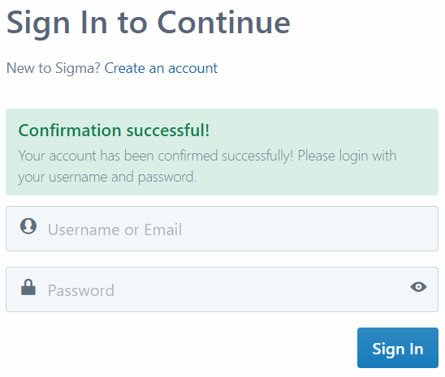

## Grant GCP access to Sigma.

1. After sign-in, you'll be in the **Cloud Credentials** page of Sigma.

   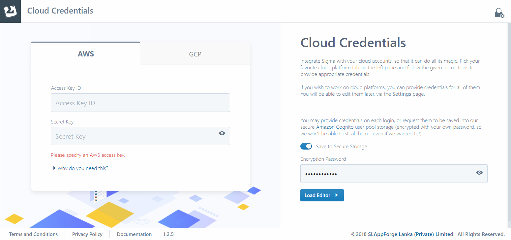

2. Switch to **GCP** tab, and click the **Authorize** button.

   

3. Copy the full content of the service account key file that you downloaded earlier,
and paste it into the text field in the **GCP Service Account Key** pop-up dialog.

   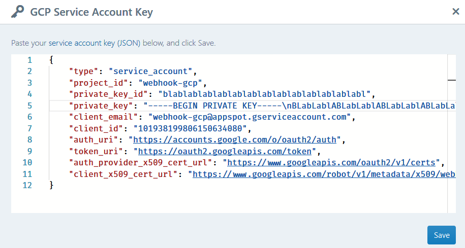

4. Click **Save**. The tab view will change with the name of the GCP project of the service account,
confirming that your service account key has been successfully interpreted.

   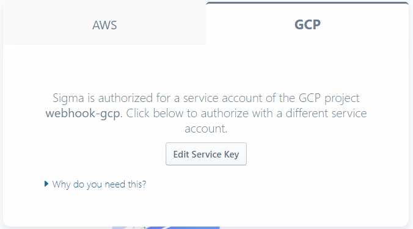

   If Sigma fails to validate your key, or is unable to access your GCP project using the key,
   an appropriate error will be displayed; if this happens, please revise the pasted key and its permissions, and try again.

   

5. Optionally, switch to the AWS tab and provide an [AWS key pair](../../getting_started.md#aws-credentials)
if you wish to also deploy on, or develop against, AWS.

   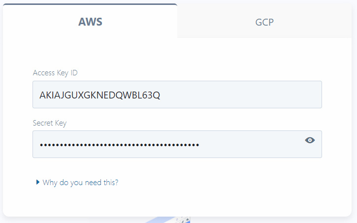

6. Sigma can save your GCP (and AWS) credentials in its
[secure AWS Cognito data store](https://docs.aws.amazon.com/cognito/latest/developerguide/synchronizing-data.html).
This is solely for your convenience; the content will be encrypted with your own password - also managed by Cognito -
or a PIN of your choice, in case you used a social media log-in.

   The IDE will automatically load and decrypt the credentials during later log-ins using the password or PIN that you enter,
   so that you would not need to provide them all over again.

   If you prefer not to save the credentials in this manner, turn off the **Save to Secure Storage** toggle.

   

7. Click **Load Editor**.

## Connect GitHub.

**NOTE:** You can integrate your **BitBucket account** in pretty much the same way.

1. Now you will be in the [projects page](https://sigma.slappforge.com/#/project),
with a quickstart pane (displaying several **Source Provider Integration options**) on the left.

   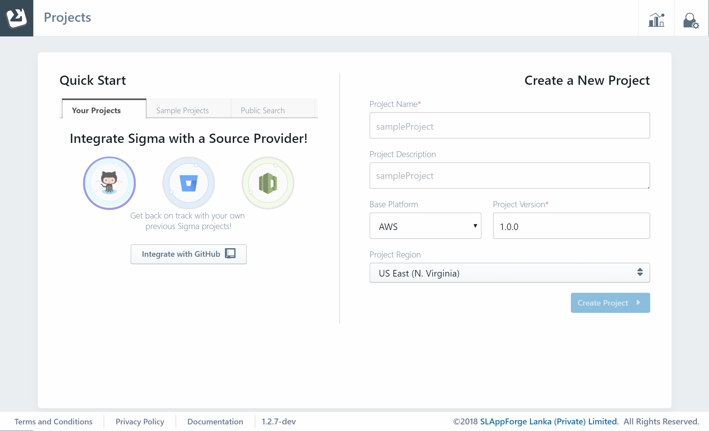

2. Click the **Integrate with GitHub** button. A GitHub authorization window will pop up
(if it does not, tune your browser to enable pop-ups for `sigma.slappforge.com` and try again).

3. On the pop-up, sign in to GitHub if you are not already signed in.

4. The pop-up will ask you to authorize the **Sigma** GitHub app (made by `slappforge`, the author of Sigma)
to connect with your GitHub account. Click the **Authorize slappforge** button to continue.

   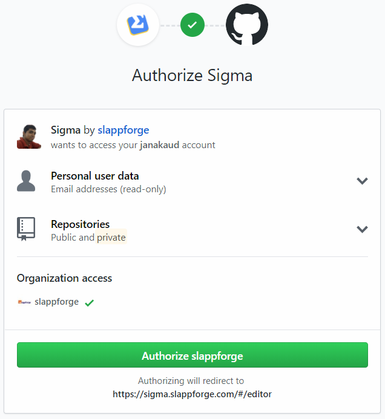

## Launch a project!

1. Once GitHub authorization is complete, the pop-up will close,
and the quickstart pane will start displaying the **already available Sigma projects**:

   * **Your Projects** tab will display any Sigma-compatible projects that are already in your GitHub account.

     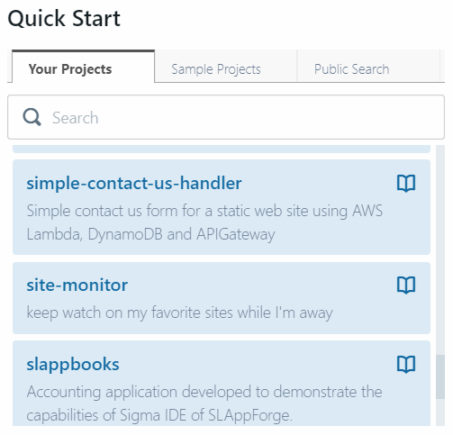

   * **Sample Projects** tab will display several sample projects published by [SLAppForge](https://github.com/slappforge/),
     which you can try out right away.

     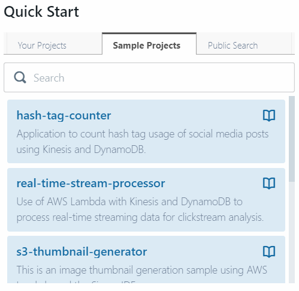

2. If you have the GitHub URL or username of any other Sigma project that you know of,
you can simply paste it in the search bar of the **Public Search** tab and hit the search button, to load it.

   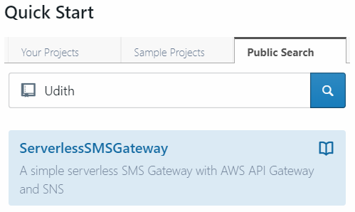

3. Once you have found the desired project, click on it to load it into the Sigma editor.

Alternatively you can **create a new project** by filling the **Create a New Project** form on the right side pane:

1. Under **Project Name**, enter a title for your project.
2. If you like, add a short description under **Project Description**, which will be displayed in GitHub etc.
3. Select a **Base Platform** for your project (in this case it would be **GCP**);
this is the serverless platform on which your project will be deployed.
4. Enter a version number of the format `x.y.z`
(compatible with [NPM versioning](https://docs.npmjs.com/about-semantic-versioning)) under **Project Version**.
5. When done, click **Create Project**.