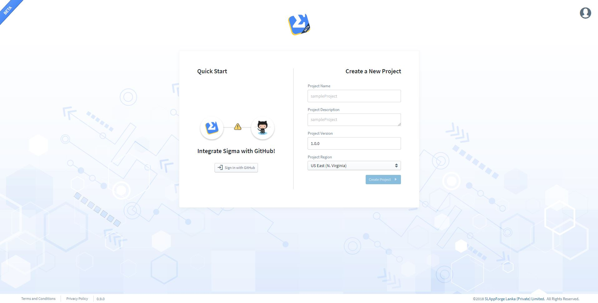

# Deploying a sample project in Sigma

In sigma, you don't necessarily have to start a project from scratch.
You may start by opening an existing project from your own GitHub account, or by opening a public project from someone else's GitHub account.

In order to make things more convenient for you, SLAppforge has provided you some sample projects covering almost all the [resources](concepts/resources.md) supported by Sigma.

You can select and open a sample project from the Project View of the IDE. There are two ways to open the Project View of Sigma.

1. At startup, after successfully logging in.

2. From the editor toolbar.

## Activating GitHub Integration

In order to activate GitHub integration, you have connect your GitHub account to Sigma by logging in with your GitHub account.

Once you successfully login with GitHub, you will see all the features available for GitHub integration.

* Your Projects\
This section lists all Sigma projects which are available in your GitHub account
* Samples\
This section lists all Sigma projects which are available in the [SLAppForge GitHub account](https://github.com/slappforge)
* Public Repositories\
This section provides you the ability to directly open any Sigma repository by URL
or to search all Sigma projects in a GitHub account by providing a GitHub username

## Opening a sample Project

To open a sample project, just click on any of the available sample projects and Sigma will do the rest.
Refer to the Readme file of the sample on the GitHub repo for instructions on deploying the project.
In many cases, you would be able to deploy and try out the sample by simply clicking on the Deploy button on the toolbar.
