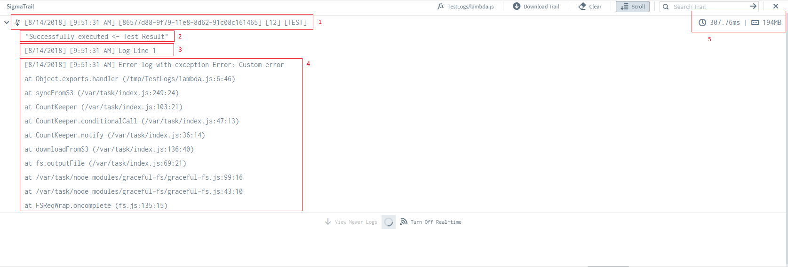
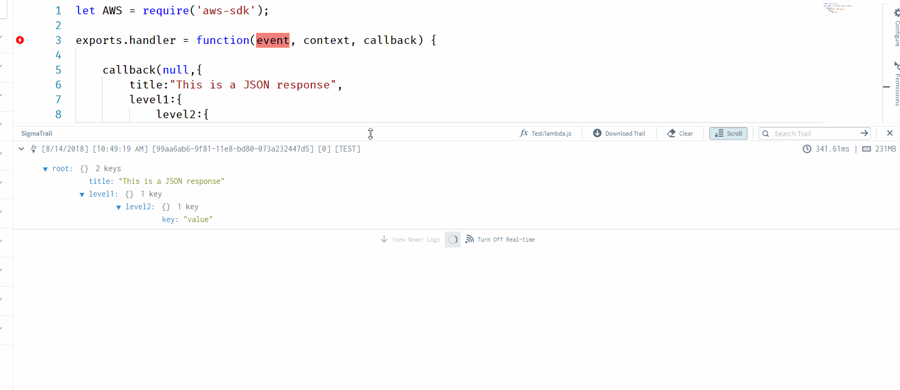

# Application Logs

In sigma, we have categorized logs into two types.

#### 1. Test Logs [TEST]

Test logs are the type, that will be generated in realtime when you execute a test case within the IDE. These logs will include the result/response of the test execution and the generated logs in line.

#### 2. Prod Logs [PROD]

Prod logs are the type, that will be generated when you invoke the lambda function through one of your event sources. (ie: Api Gateway, S3 event etc.)
These logs does not include the result/response of the execution.

## Log Request

We refer log request as the group of log lines which are generated during a one cycle of execution of lambda function.

# 

1. Log Request header

Log request header gives you a quick insight about the Log Request. The format of the header is as follows.

[Date] [Time] [Request Id] [No of log lines] [TEST / PROD]

You can click on Log request header to expand or collapse the log lines.

2. Test execution result

This section is only applicable for TEST logs. If the result can be parsed to a JSON, Sigma will show you the response in an expandable JSON tree.

# 

3. Log line

Log line is a single line of a console log generated by lambda code

4. Stack Trace

Stack trace is a report of the active stack frames at the time of an error is thrown. This will be useful when debugging an application.

5. Resource Utilization

This section indicates the time taken to execute the function logic and the memory utilized to process the respective request.

## Sigma Trail Controllers

# 

Sigma trail header has following controls to fine tune your logs view.

1. Lambda Selector
 
 Sigma Trail shows only trails related to one particular function within one screen. If you want to switch sigma trail to show trails of a different function, click on this button to get a list of available lambda functions.
 
 In addition to this selector, switching between editor tabs will automtically switch Sigma Trail to show logs of the focused function.
 
 2. Download Trail
 
 Sigma allows you to download logs in following two formats.
 
 * Text
 * JSON
 
 3. Clear Logs
 
 If you are not interested about the visible logs, you can hide visible logs by this button.
 
 4. Auto Scroll 
 
 Sigma automatically scrolls the trail for you. Whenever a new Log request is appended, trail will get automatically scrolled and expand the new log request. You may switch on/off this feature by toggling this button.
 
 5. Search logs
 
You can filter Sigma trails by using [cloudwatch filter pattern and syntax](https://docs.aws.amazon.com/AmazonCloudWatch/latest/logs/FilterAndPatternSyntax.html).

This will give you an effect similar to tailing with grep.

6. Close

Close the sigma trail panel.

## Resizing logs view

If you want to make more room for your code, you may resize sigma trail by holding and dragging the header as below.

# 

