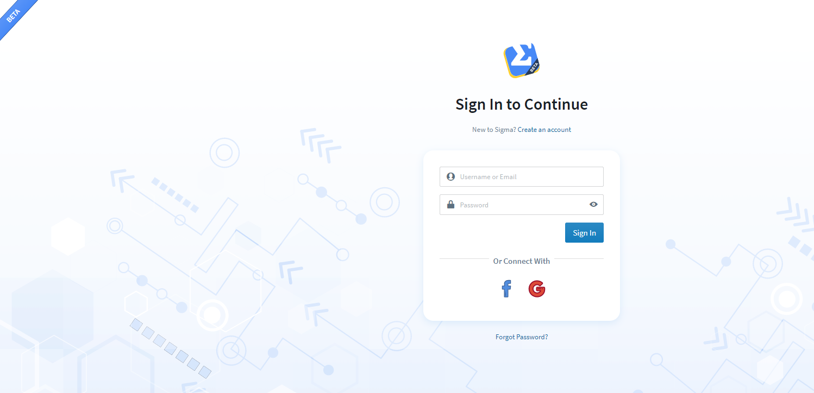
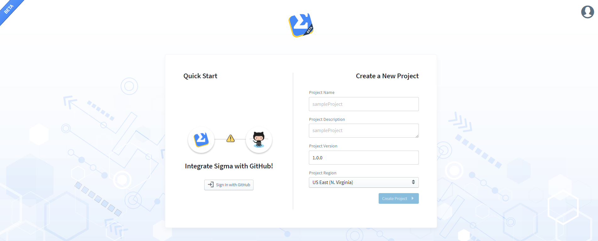
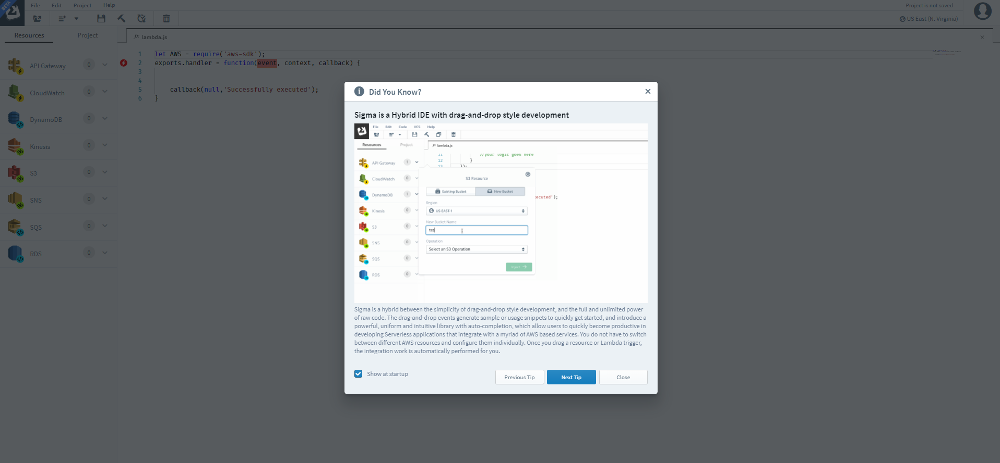
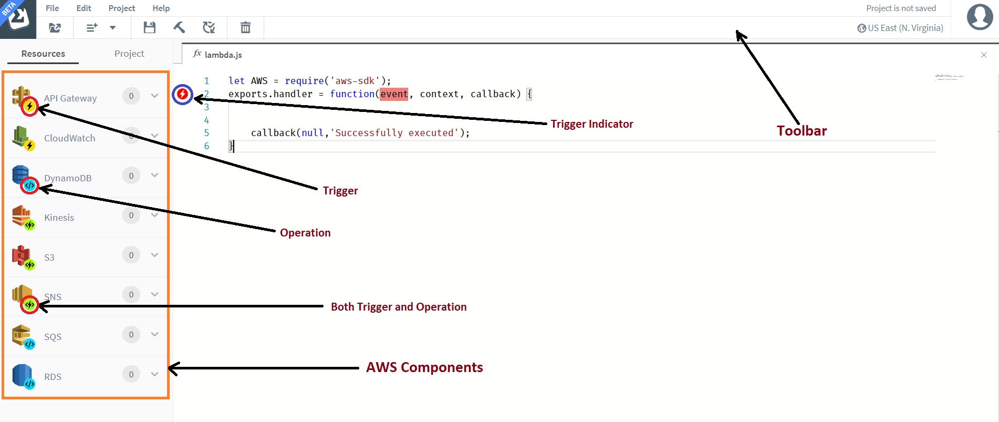
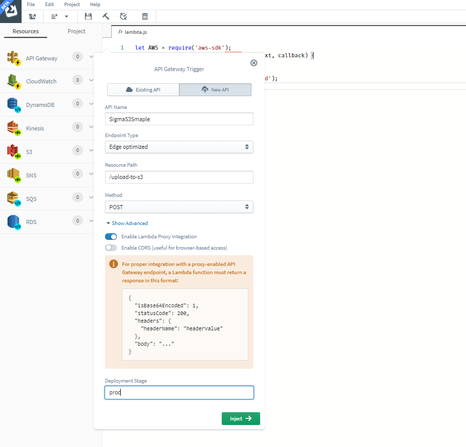
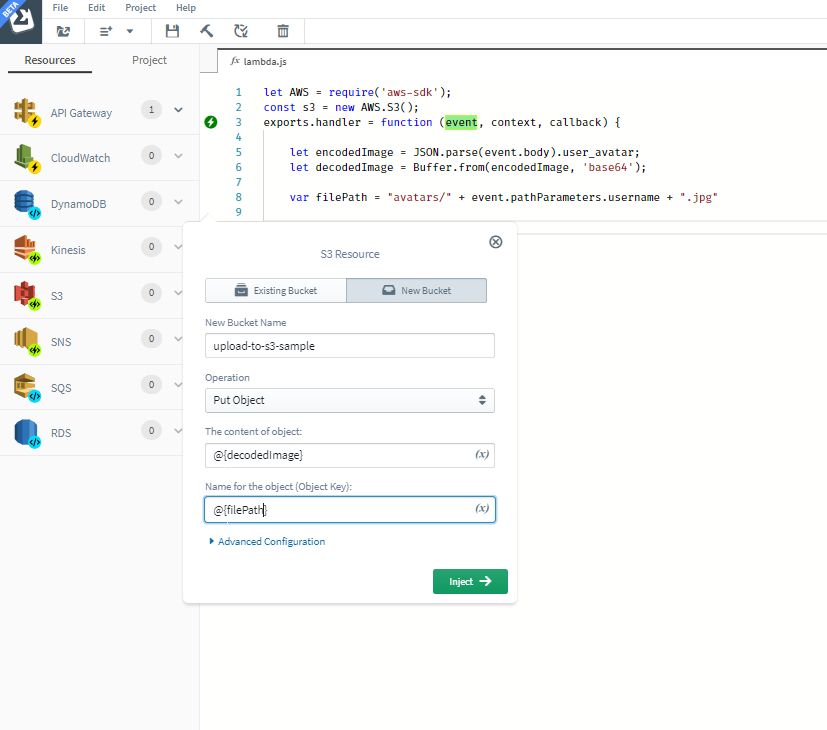
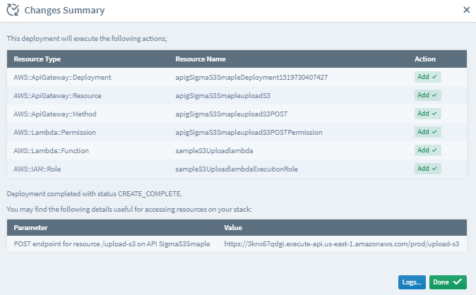

# Deploying my first project
Let's see how we can deploy a project of a simple use case which uses some AWS components such as API Gateway and S3.

### Sign In or Sign Up to Sigma IDE

First of all you need to sign in to your [Sigma Account](https://sigma.slappforge.com/#/signin). If you don't have an account already, it's high time to create an account.



After you sign in, you will be directed to a web page as shown in Fig 2.

At the next step, you will need to provide a GitHub Account which is used for storing your project you have created with Sigma IDE.



When you sign in using GitHub, you will see the projects associated with Sigma in **Your Projects** tab.

**Even if you did not Sign In to GitHub at this point, you will anyway have to sign in later on when saving your project.**

### Create New Project


After you create your project successfully, you will be directed to a page as in Fig 4.



You will be taken through a small guide on what you can do with the Sigma IDE at the beginning.
We provide your own editor area to write your own code to get your use case a live and working one with AWS components.

### Introduction to Sigma IDE

You can access AWS Components provided for Sigma IDE from the Resources tab as shown in Fig 5.



You can drag and drop the AWS Components to the editor listed under resources appropriately.

The trigger indicator will show, what kind of a component is required to the specified code segment and what kind of component is used.

 The toolbar provides several functionalities as shown in Fig 6.

 

 **1. Change Project** : Allows you to switch between projects you have under your account.

 **2. Add Dependency** : Allows you to add several dependencies related to your implementation.

 **3. Save Project** : Committing your project to the GitHub account you have provided.

 **4. Build Project** : Builds your project.

 **5. Deploy Project** : Deploy the Lambda in AWS.

 **6. Clean Unused Resources** :  Used to clean unused resources.

### Sample Project

Now let's start working on our use case.

Use Case: Uploading an image to a S3 bucket through an API call done using API Gateway from a mobile/web application.

In the above use case, we will be using API Gateway and S3 as resources.

The trigger for the Lambda will be POST API REST Call that comes through the API Gateway which includes the image in the body of the POST call.

Let's first add the an API Gateway trigger for the event. Drag the API Gateway to the **event** and release. Now you can see the resource pop up as shown in the Fig 7.



The API call needed for the above use case is a POST.

In the use case, let's assume that the image we need to upload to S3 comes as a **Base64** encoded string. Then we have to create a buffer out of this Base64 encoded string to upload to S3.

Drag the S3 trigger to the editor and the S3 resource pop up will show.



Since we are putting a new object to a S3 bucket, we have to use the Put Object Operation.

Following code snippet shows the final lambda implementation for the above use case.

````
let AWS = require('aws-sdk');
const s3 = new AWS.S3();
exports.handler = function (event, context, callback) {

	let encodedImage = JSON.parse(event.body).user_avatar;
	let decodedImage = Buffer.from(encodedImage, 'base64');

	var filePath = "avatars/" + event.pathParameters.username + ".jpg"

	s3.putObject({
		"Body": decodedImage,
		"Bucket": "upload-to-s3-sample",
		"Key": filePath
	})
		.promise()
		.then(data => {
			console.log(data);           // successful response
		   let response = {
        "statusCode": 200,
        "headers": {
            "my_header": "my_value"
        },
        "body": JSON.stringify(data),
        "isBase64Encoded": false
    };
        callback(null, response);
		})
		.catch(err => {
			console.log(err, err.stack); // an error occurred
			 callback(err, null);
		});


}

````

Now to deploy your project, click on **Deploy Project** in the toolbar or Go to **Project &rarr; Deploy Project**.
You will be asked for a commit message as shown in Fig 9.


Next you will see a summary of AWS related changes that will take place due to the deployment of the project as shown in Fig 10. Press **Execute** to continue the deployment.


Now if you can see the **Changes Summary** showing a message as below, that means your deployment is successful!!



Happy Coding with Sigma IDE!!
